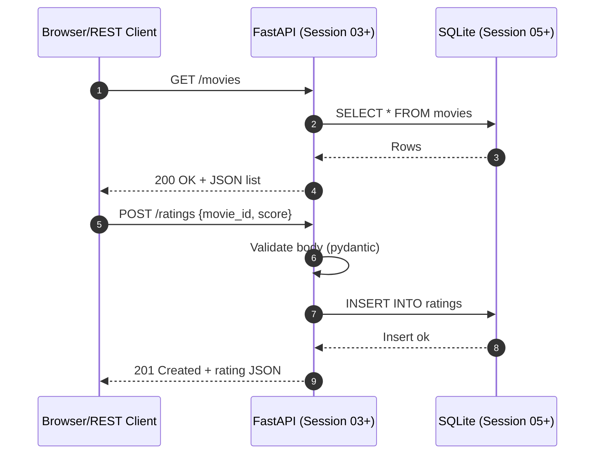

# Session 02 – Introduction to HTTP and REST

- **Date:** Monday, Nov 10, 2025
- **Theme:** Understand how clients and servers communicate and practice sending requests yourself.

## Learning Objectives
- Describe the parts of an HTTP request and response.
- Use `httpx`, `curl`, and the VS Code REST Client to call public APIs.
- Preview Exercise 1 and understand expectations for a RESTful service.

## Agenda
| Segment | Duration | Format | Focus |
| --- | --- | --- | --- |
| Recap + warm-up question | 5 min | Discussion | Ask “What worked and what broke during your uv setup?” and check that everyone started the AWS Compute module |
| HTTP fundamentals | 25 min | Talk with illustrations | URLs, methods, status codes, headers, JSON payloads |
| REST design principles | 20 min | Talk + whiteboard | Resources vs. actions, idempotency, predictable endpoints |
| Lab 1 | 45 min | Guided coding | Build a tiny HTTP client with `httpx` |
| Break | 10 min | — | Encourage stretching |
| Lab 2 | 45 min | Guided practice | Explore requests with `.http` files and retry helpers |
| EX1 briefing | 10 min | Talk + Q&A | Share scope, rubric, Tuesday deadline |



## Teaching Script – HTTP Fundamentals
1. Draw a simple diagram on the board: laptop → internet → server. Label “Client” and “API”.
2. Explain the anatomy of a request: “Method (GET, POST), URL, headers (metadata), body (JSON).”
3. Show a sample request/response pair:
   ```
   GET https://httpbin.org/get?city=Haifa
   Headers: Accept: application/json

   Response 200 OK
   {
     "args": {"city": "Haifa"},
     "headers": {...},
     "origin": "1.2.3.4"
   }
   ```
4. Define REST in simple terms: “Use nouns for resource names, use HTTP verbs for actions, return predictable JSON.”
5. Introduce tools we will use: browser dev tools (Network tab), `curl`, VS Code REST Client extension, `httpx`.
6. Announce Exercise 1: “Next week you build a small FastAPI service with CRUD endpoints, tests, and Docker packaging. It is assigned today and due Tuesday, Dec 2.”
7. Remind students that the **AWS Compute** module should be wrapped up by **Tuesday, Nov 25**, even though the hard cutoff for all AWS modules is **Tuesday, Dec 16, 2025**.

## Part B – Hands-on Lab 1 (45 Minutes)
### Setup Commands
```bash
cd hello-uv
uv add httpx pydantic
mkdir -p app
touch app/__init__.py app/client.py
```

### Instructor Live Coding
Create `app/client.py` with the following content and read the comments aloud:
```python
from typing import Any, Dict
import httpx
from pydantic import BaseModel, ValidationError


class PingResponse(BaseModel):
    args: Dict[str, Any]
    url: str


def ping() -> PingResponse:
    """Call httpbin and return the validated JSON payload."""
    with httpx.Client(timeout=10.0) as client:
        response = client.get(
            "https://httpbin.org/get",
            params={"ping": "pong"},
            headers={"Accept": "application/json"},
        )
        response.raise_for_status()
        return PingResponse.model_validate(response.json())


if __name__ == "__main__":
    try:
        data = ping()
    except (httpx.HTTPError, ValidationError) as exc:
        print(f"Request failed: {exc}")
    else:
        print(f"Server echoed our args: {data.args}")
```

### Student Checklist
- Run `uv run python app/client.py`.
- Confirm the console prints `Server echoed our args: {'ping': 'pong'}`.
- Change the parameter to `{"ping": "class"}` and rerun.
- If validation fails, check the error message and adjust.

## Part C – Hands-on Lab 2 (45 Minutes)
### REST Client Practice
1. Install the REST Client extension in VS Code.
2. Create `requests.http` with:
   ```
   ### GET echo
   GET https://httpbin.org/get?ping=pong
   Accept: application/json

   ### POST echo
   POST https://httpbin.org/post
   Content-Type: application/json

   {
     "message": "Hello REST"
   }
   ```
3. Click “Send Request” for each block and inspect the response panes.

### Retry Helper Exercise
Add this helper to `app/client.py` below the previous code:
```python
import time


def get_with_retry(url: str, retries: int = 3, delay: float = 0.5) -> PingResponse:
    """Retry the ping when the server returns a transient error."""
    attempt = 0
    while True:
        attempt += 1
        try:
            with httpx.Client(timeout=10.0) as client:
                response = client.get(url, timeout=10.0)
                response.raise_for_status()
                return PingResponse.model_validate(response.json())
        except httpx.HTTPStatusError as exc:
            if exc.response.status_code >= 500 and attempt < retries:
                print(f"Server error {exc.response.status_code}, retrying...")
                time.sleep(delay)
                continue
            raise
```

Test it quickly by calling an invalid endpoint to trigger retries. Discuss why client-side retries must be limited and logged.

## Exercise 1 Briefing (10 Minutes)
- **Goal:** Build a FastAPI service with CRUD endpoints, validation, tests, and a Dockerfile.
- **Assigned:** Today.
- **Due:** Tuesday, Dec 2, 2025 at 23:59.
- **Deliverables:** Repository with FastAPI app, pytest suite, Docker image instructions, README documenting setup and any AI help.
- Encourage students to start by copying today’s client to test their future server.

## Troubleshooting Tips
- If `httpx` cannot reach the internet, check proxy/firewall settings and try from a phone hotspot.
- Validation errors show which field is missing; read the exception message aloud.
- Windows PowerShell users may need to escape quotes differently (`\"`)—demonstrate one example.

## Student Success Criteria
- Can explain the purpose of HTTP methods and status codes.
- Successfully run `app/client.py` and interpret the JSON response.
- Understand what a RESTful API should look like for Exercise 1.
- Have a clear plan to finish the AWS Compute module before **Tuesday, Nov 25, 2025**, leaving buffer ahead of the **Tue Dec 16, 2025** hard deadline for all AWS modules.

## AI Prompt Kit (Copy/Paste)
- “Explain HTTP methods (GET/POST/PUT/DELETE) for beginners and provide a JSON example for each.”
- “Write a Python `httpx` client function that retries on 500 errors with exponential backoff and logs attempts.”
- “Draft a README snippet describing how to run a VS Code REST Client file against httpbin.”

## Quick Reference (External Search / ChatGPT)
- **Google:** `httpbin get request example curl`
- **ChatGPT prompt:** “Generate a VS Code REST Client file that sends GET and POST requests to httpbin and explains each header in plain language.”
